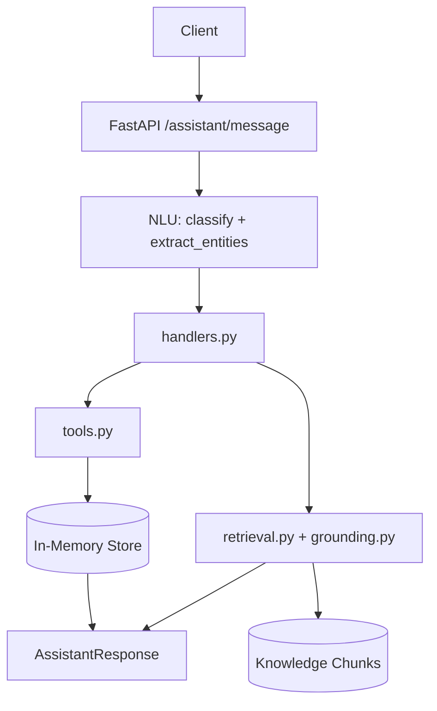
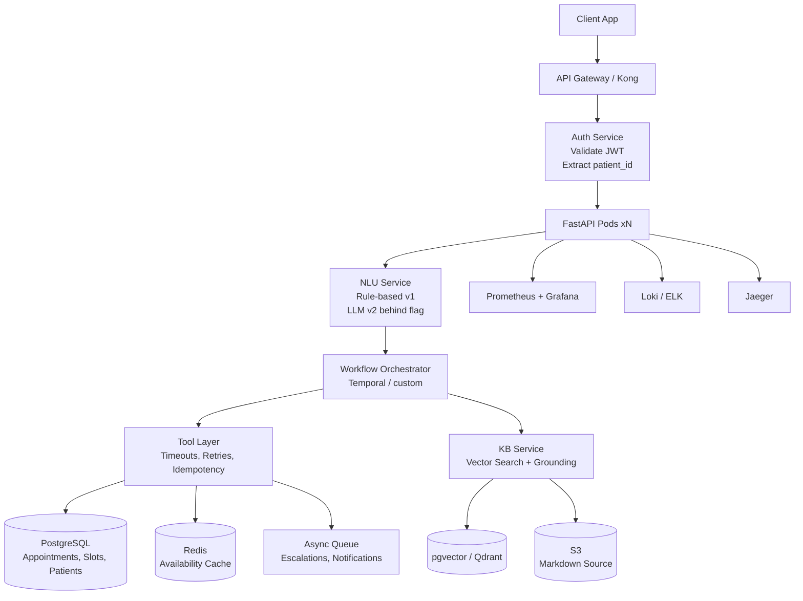

# Production Architecture (Part 10)

## Current Take-Home Architecture

## Production Architecture

## What Changes from Take-Home

| Layer | Take-Home | Production |
|-------|-----------|------------|
| **Auth** | `patient_id` in request body | JWT validation, session management, RBAC |
| **Store** | In-memory dict | PostgreSQL + row-level security, advisory locks for concurrency |
| **Availability** | Computed on-demand | Materialized view + Redis cache (TTL 30s) |
| **Tools** | Sync functions | Async with timeouts (5s), retries (3x), idempotency keys |
| **Workflow** | In-memory `_FLOWS` dict | Temporal / durable execution (survives restarts) |
| **KB** | TF-IDF on chunks | Hybrid: BM25 + embeddings (bge-m3), reranker, grounding v2 |
| **NLU** | Rule-based only | Rule-based v1 + LLM v2 behind feature flag, A/B test |
| **Observability** | `logging.info` | Structured logs, metrics, traces, alerts |
| **Deployment** | Single container | K8s: HPA, PodDisruptionBudget, blue/green |
| **Secrets** | None | Vault / SealedSecrets, rotation |
| **Compliance** | None | PDPL (Saudi), audit logs, data residency (KSA region) |

## Saudi-Specific Considerations

- **Data residency**: All PHI in KSA region (STC, AWS Bahrah, Azure KSA, Google Dammam)
- **PDPL compliance**: Consent, purpose limitation, retention policy, DPO appointed
- **Language**: Arabic-first UI; NLU must handle Najdi, Hejazi, Gulf dialects
- **Calendar**: Hijri date support alongside Gregorian
- **Prayer times**: Slot availability excludes prayer windows
- **Gender segregation**: Specialty/doctor assignment rules

## Migration Path

1. **Phase 1** (Week 1-2): PostgreSQL + Redis + auth + observability
2. **Phase 2** (Week 3-4): Tool layer with timeouts/retries + idempotency
3. **Phase 3** (Week 5-6): Durable workflow engine (Temporal)
4. **Phase 4** (Week 7-8): Vector KB + hybrid retrieval + LLM NLU behind flag
5. **Phase 5** (Week 9-10): Load test, chaos engineering, compliance audit